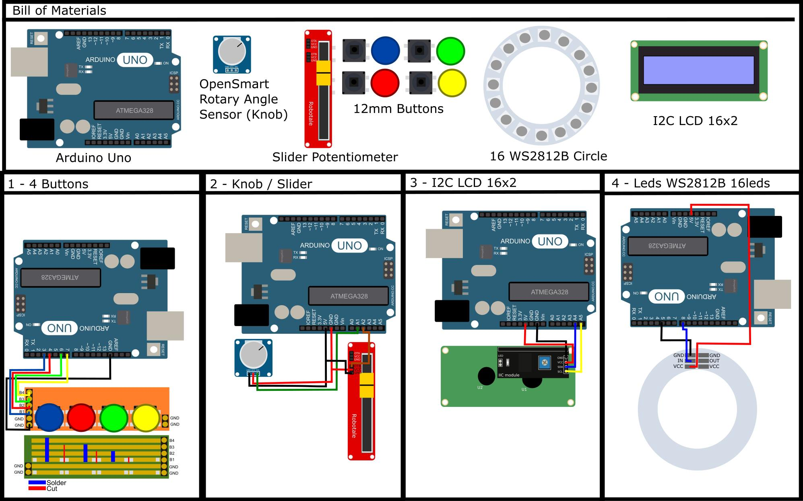

# fanthome_controller
Unity Wrmhl Alternative controller    
https://github.com/relativty/wrmhl by Maxime Coutte Peroumal Corne

# Librairies
* LiquidCrystal_I2C
* FastLed

# BOM / Wiring

https://github.com/usini/usini-cards/blob/master/diagrams/controls/fanthome_controller.svg

# Serial Protocol
## Knob
* 15:VALUE (0-180)

## Slider
* 16:VALUE (0-255)

## Yellow Button
* 7:1
* 7:0

## Green Button
* 6:1
* 6:0

## Red Button
* 4:1
* 4:0

## Blue Button
* 3:1
* 3:0

## LCD Message
* LCD1
* LCD2
* LCD3

## Leds
* @0-16
